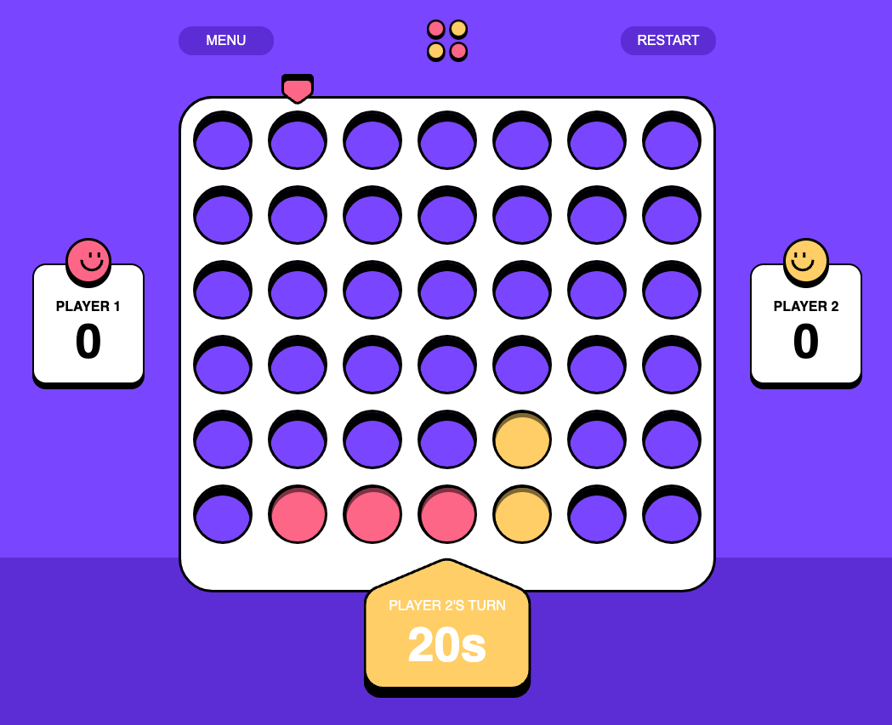

# Frontend Mentor - Connect Four game solution

This is a solution to the [Connect Four game challenge on Frontend Mentor](https://www.frontendmentor.io/challenges/connect-four-game-6G8QVH923s). Frontend Mentor challenges help you improve your coding skills by building realistic projects. 

## Table of contents

- [Overview](#overview)
  - [The challenge](#the-challenge)
  - [Screenshot](#screenshot)
  - [Links](#links)
- [My process](#my-process)
  - [Built with](#built-with)
  - [What I learned](#what-i-learned)
- [Author](#author)

## Overview

### The challenge

Users should be able to:

- View the game rules
- Play a game of Connect Four against another human player (alternating turns on the same computer)
- View the optimal layout for the interface depending on their device's screen size
- See hover and focus states for all interactive elements on the page

### Screenshot

### Links

- Solution URL: [URL](https://nathanielfischer.github.io/Connect-Four-Game_Frontend-Mentor-/)

## My process

### Built with

- HTML5
- CSS
- JavaScript
- jQuery

### What I learned

- Better understanding of using SVGs
- How to change the DOM with jQuery when the window is resized

## Author

- Github - [Nathaniel Fischer](https://github.com/nathanielfischer)